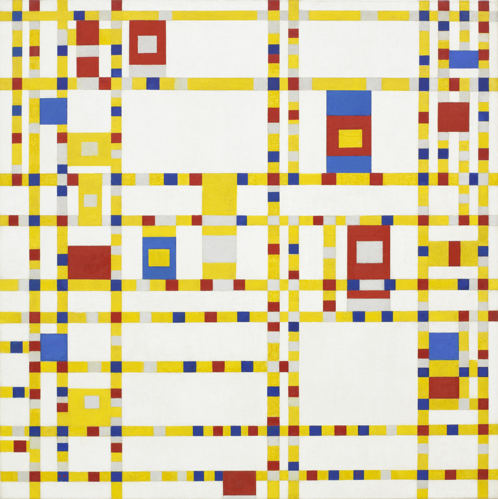
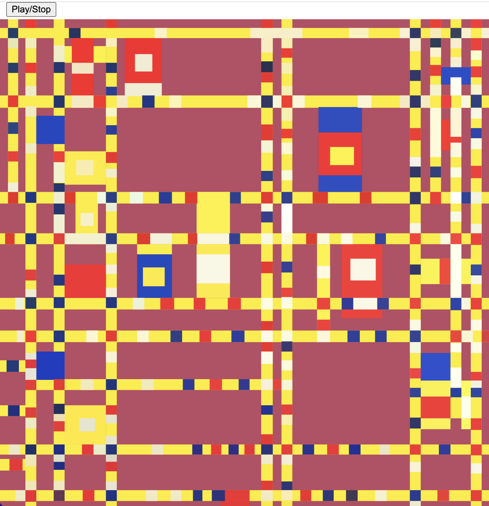
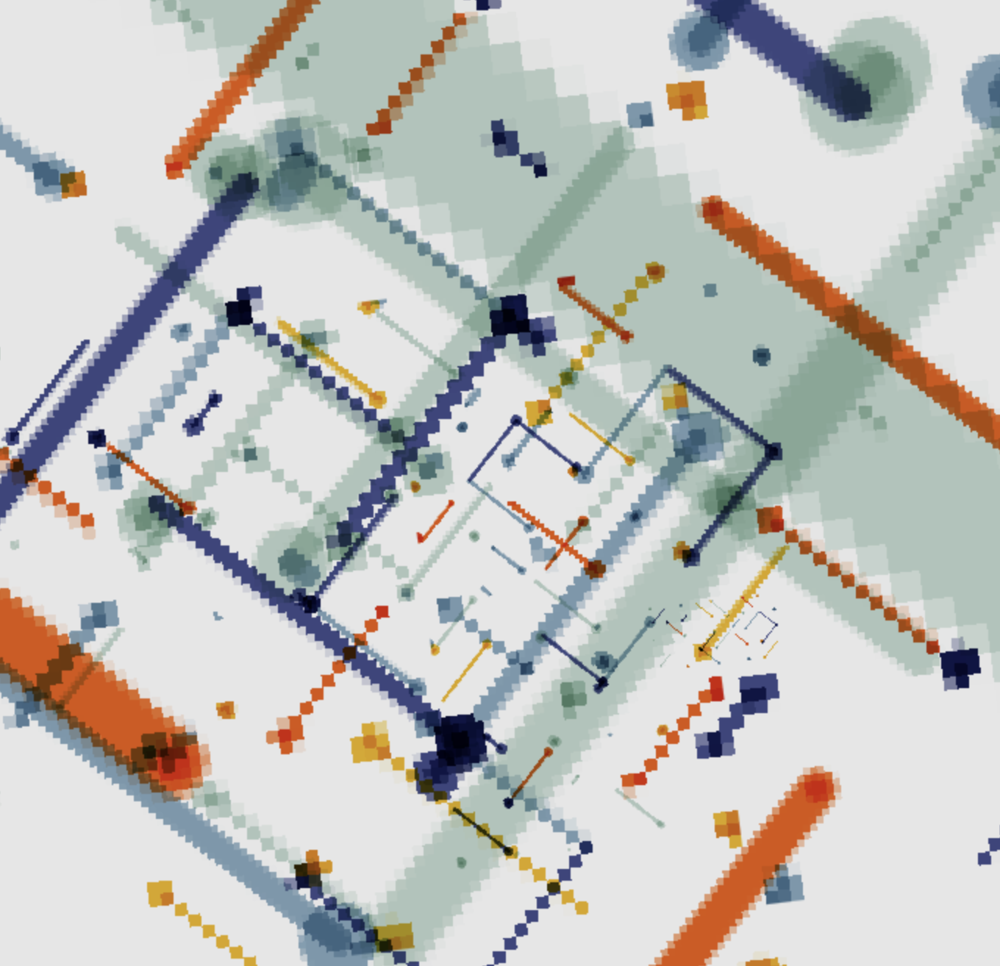

# Creative-coding-major-project
# Audio

### Individual Task
<!-- #### Header 4
##### Header 5
###### Header 6
**Bold Text** or __Bold Text__
*Italic Text* or _Italic Text_ -->
-Our group selection is Piet Mondrian's Broadway Boogie Woogie by Piet Mondrian is one of his famous works. The variant I chose was audio: animating the level or frequency content of a sound track.

 
 

### Instructions on how to interact with the artwork
At the top of the page you will see a button, clicking the button will start the music playing. Once the music starts the animation will start playing along with the music.
For more information about your personal approach to animating group code.
I chose to select to animate my personal code with audio.The length, width and colour of the graphics are used to create animation effects.

 
 

 There are also references to previous animation inspirations here. Inspired by the effect of the rubber disc in the middle vibrating with the amplitude of the music when the music player is playing.
 
 

### Short technical note

   1. first through the p5.Amplitude () to get the amplitude of the music object amp, at the same time through the amp.getLevel () to get amplitude
   2. then use the amplitude to calculate the radius of the effect range, the element zoom size, and the background colour change value.
   3. finally, for each sub-element object, determine whether the object is in the starting range, if it is in the starting range, then update the object's attribute values (length, width) and update the background colour of the whole pattern (gradually changing to red).
